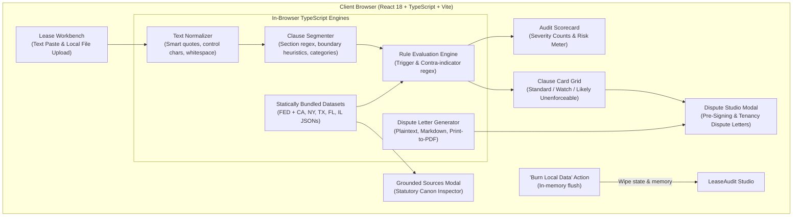

# Architecture Specification: LeaseAudit

**One-liner:** Paste or upload a residential lease. Get a 100% local, statute-grounded breakdown of which clauses are enforceable, which are likely illegal in your jurisdiction, and a generated dispute letter — before you sign or before your landlord tries to enforce something they shouldn't.

---

## 1. System Overview & Philosophy

### 1.1 Core Principles
1. **100% Client-Side Local & Air-Gapped by Design:** No lease text, metadata, or PII ever leaves the user's browser. Processing occurs purely in-browser using TypeScript domain engines. Zero backend servers, zero telemetry, zero cloud calls.
2. **Statute-Grounded Truth:** Every flag (Standard, Watch, Likely Unenforceable) is tied to a specific statutory citation (e.g., `Cal. Civ. Code § 1950.5(c)`). No hallucinated rules, no generic AI advice without statutory lineage.
3. **CareCheck Standard Parity:** Follows the established architectural benchmark of `careCheck`: 3-rail audit workbench, interactive Grounded Sources modal, 1-click "🔥 Burn Local Data" memory purge, and dispute generator studio.
4. **Accessible by Default:** Full WCAG AA compliance baked into every component from day one.
5. **Ephemerality & User Control:** A dedicated "Burn Local Data" action immediately wipes all session memory, parsed objects, and local state.

### 1.2 Architecture Diagram



---

## 2. Ingestion & Document Extraction Pipeline

Lease documents arrive in varying formats and quality. The ingestion layer converts any accepted format into normalized, structured text chunks while preserving structural section markers.

### 2.1 Supported Formats
- **Plain Text / Direct Paste:** UTF-8 normalized text directly input into the workbench textarea.
- **Local File Upload (`.txt`, `.md`, `.text`):** Read client-side via the HTML5 `FileReader` API without network transmission.
- **Ready-to-Audit Reality Samples:** Instant one-click pre-loads of California (AB 12), New York (HSTPA), and Federal Discrimination sample leases.

### 2.2 Text Normalization Rules
1. Control character filtering (stripping non-printable ASCII).
2. Typographical character standardization (replacing smart quotes `“”` with `""`, `‘’` with `''`, and em/en-dashes `—–` with `-`).
3. Newline normalization (converting `\r\n` and `\r` to `\n` and collapsing excessive blank lines).

---

## 3. Clause Segmentation & Classification Engine

Lease agreements are segmented into discrete clause units before evaluation against statutory rules.

### 3.1 Deterministic Rules & Regex Segmentation
The core segmentation engine (`src/core/segmenter.ts`) runs purely on pattern heuristics:
- **Heading & Numbering Boundaries:** Matches standard lease numbering schemes (`Section \d+`, `Paragraph \d+`, `\d+\.\d+`, `[A-Z\s]{4,30}:`).
- **Keyword Clustering:** Groups sentences around key legal categories:
  - Security Deposits (`deposit`, `escrow`, `deductions`, `wear and tear`, `interest`)
  - Fees & Rent (`late fee`, `grace period`, `returned check`, `bounced fee`)
  - Entry & Privacy (`right of entry`, `24 hours`, `notice to enter`, `inspect`)
  - Maintenance & Habitability (`as-is`, `repairs`, `tenant responsible for all maintenance`, `pest control`)
  - Eviction & Termination (`re-enter`, `lockout`, `self-help`, `terminate without notice`, `waives notice`)
  - Liability & Disclosures (`hold harmless`, `indemnify`, `waives jury trial`, `lead paint`, `bedbugs`)
  - Military / Protections (`military transfer`, `active duty`, `SCRA`)

### 3.2 Rule Evaluation
- Evaluates clauses against both state-specific rules and federal baseline rules.
- Triggers match abusive language while contra-indicators safely bypass compliant language (e.g. statutory exceptions or compliant notice periods).
- Assigns severity: `Standard` (compliant), `Watch` (advisory), or `LikelyUnenforceable` (statutory conflict).
- Aggregates statutory citations, summaries, explanations, and dispute remedies.

---

## 4. Statute Rules Dataset & Data Contracts

### 4.1 Schema Specifications

#### Rule Definition Schema (`src/contracts/statute.ts`)
```typescript
export interface RuleItem {
  id: string;
  category: ClauseCategory;
  name: string;
  severity: ClauseSeverity;
  statuteCitation: string;
  statuteSummary: string;
  officialUrl: string;
  triggerPatterns: string[];
  contraIndicatorPatterns: string[];
  disputeTemplate: string;
}

export interface JurisdictionRules {
  jurisdiction: string;
  jurisdictionName: string;
  statuteVersion: string;
  lastAudited: string;
  officialSourceUrl: string;
  rules: RuleItem[];
}
```

### 4.2 Statute Canon
- **Federal (`FED`)**: FHA familial status (42 U.S.C. § 3604(a)), assistance animals (§ 3604(f)(3)(B)), SCRA military early termination (50 U.S.C. § 3955), Lead-Based Paint Hazard Act (42 U.S.C. § 4852d).
- **California (`CA`)**: Cal. Civ. Code § 1950.5(c) (1-month deposit cap under AB 12), § 1950.5(g) (21-day return), § 1954 (24h entry notice), § 789.3 (lockout & utility shutoff ban), § 1941.1 & § 1942.1 (implied warranty of habitability), § 1671 (late fees).
- **New York (`NY`)**: N.Y. Gen. Oblig. Law § 7-108(1-a)(a) (HSTPA 1-month cap), § 7-108(1-a)(e) (14-day return), Real Prop. Law § 238-a(2) ($50 or 5% late fee cap), § 768 (unlawful eviction criminalization), § 235-b (habitability), § 235-f (Roommate Law).
- **Texas (`TX`)**: Tex. Prop. Code § 92.103 (30-day return), § 92.019 (2-day grace period, 10-12% cap), § 92.0081 (lockout ban), § 92.008 (utility shutoff ban), § 92.056 & § 92.006 (duty to repair).
- **Florida (`FL`)**: Fla. Stat. § 83.49(3)(a) (15-day return / 30-day claim), § 83.53(2) (Miya's Law 24h repair notice), § 83.67 (prohibited practices), § 83.51 & § 83.47 (habitability).
- **Illinois (`IL`)**: 765 ILCS 710/1 (Deposit Return Act 30/45-day), 735 ILCS 5/9-101 (detainer/lockout ban), 765 ILCS 720/1 (retaliatory eviction ban), 765 ILCS 715/1 (Deposit Interest Act for 25+ units).

---

## 5. Dispute Letter Generation Engine

The Dispute Studio (`src/core/dispute-generator.ts`) produces formal communications based on user selection:
1. **Pre-Signing Amendment Request**: Professional letter proposing deletion or modification of unenforceable terms prior to contract execution.
2. **Notice of Unenforceability (Active Tenancy)**: Formal notice asserting that signed provisions conflict with governing law, reserving all statutory rights, and demanding written confirmation that void terms will not be enforced.

Features:
- Automatic statutory citation cross-referencing.
- Exact quotation of offending lease language formatted with markdown blockquotes.
- Non-waiver reservation of rights under federal, state, and municipal law.
- 1-click clipboard copy, plain text `.txt` download, and print-to-PDF formatting.

---

## 6. Privacy & Air-Gap Guarantees

- **No Remote Egress:** All computations occur inside the browser session.
- **Zero Telemetry:** No analytics scripts, third-party cookies, or trackers.
- **No IP Geolocation:** Manual jurisdiction selection ensures complete privacy.
- **🔥 Burn Local Data:** Flushes all React state, session buffers, and memory on demand.

---

## 7. Testing & Quality Assurance

- **Vitest Unit Test Suite (`npm test`)**: 23 automated tests covering text normalization, clause segmentation, rule evaluation, dispute letter generation, and statutory citation validation.
- **TypeScript Static Verification (`npx tsc --noEmit`)**: Strict type checking with zero errors.
- **Vite Production Build (`npm run build`)**: Bundles minified assets into `dist/`.
- **Zero Runtime Prerequisites**: Runs on any modern web browser via Node.js 18+.
