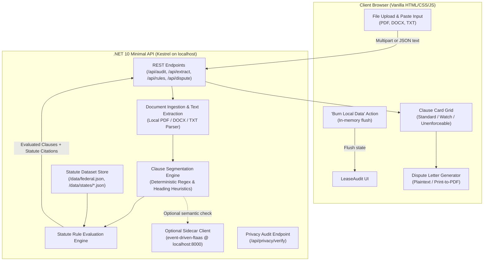
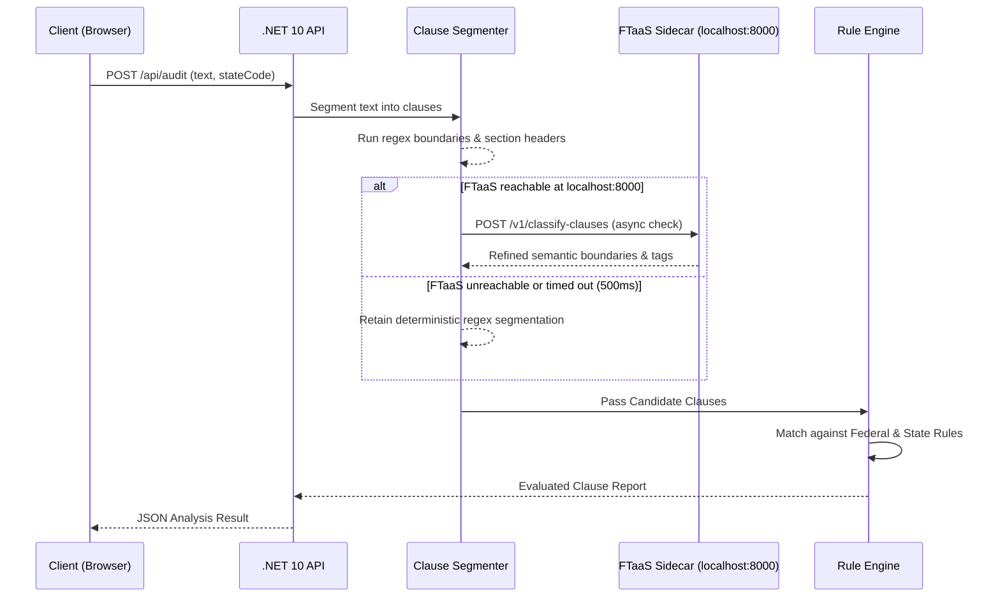

# Architecture Specification: LeaseAudit

**One-liner:** Paste or upload a residential lease. Get a 100% local, statute-grounded breakdown of which clauses are enforceable, which are likely illegal in your jurisdiction, and a generated dispute letter — before you sign or before your landlord tries to enforce something they shouldn't.

---

## 1. System Overview & Philosophy

### 1.1 Core Principles
1. **Local-First & Air-Gapped by Design:** No lease text, metadata, or PII ever leaves the user's device. Processing occurs inside the local .NET 10 process and browser memory.
2. **Statute-Grounded Truth:** Every flag (Standard, Watch, Likely Unenforceable) is tied to a specific statutory citation (e.g., `Cal. Civ. Code § 1950.5`). No hallucinated rules, no generic AI advice without statutory lineage.
3. **Graceful Enhancement:** Operates deterministically standalone with zero external dependencies. If a local inference service (such as `event-driven-ftaas` at `http://localhost:8000`) is running, LeaseAudit silently enhances clause boundary detection and semantic nuance without failing or alerting when it is absent.
4. **Accessible by Default:** Full WCAG AA compliance baked into every component from the first commit—not retrofitted.
5. **Ephemerality & User Control:** A dedicated "Burn Local Data" action immediately wipes all session memory, parsed objects, and local state.

### 1.2 Architecture Diagram



---

## 2. Ingestion & Document Extraction Pipeline

Lease documents arrive in varying formats and quality. The ingestion layer converts any accepted format into normalized, structured text chunks while preserving structural section markers.

### 2.1 Supported Formats
- **Plain Text / Direct Paste:** UTF-8 normalized text directly passed via POST payload.
- **PDF Documents (`.pdf`):** Extracted using local managed .NET text extraction (e.g., `PdfPig` / `UglyToad.PdfPig`) without external binaries or cloud OCR. Extracts text flow, page coordinates, and font weight hints for heading detection.
- **Word Documents (`.docx`):** Extracted using OpenXML / managed zip parsing of `word/document.xml`, extracting paragraphs, headings (`Heading 1`, `Heading 2`), and bold text runs.
- **Raw Text Files (`.txt`, `.rtf`, `.md`):** Stream-read with encoding detection (UTF-8, UTF-16, Latin-1).

### 2.2 Text Normalization Rules
1. Whitespace unification (collapsing non-breaking spaces, excessive horizontal whitespace).
2. Bullet point and numbering standardization (`1.`, `1.1`, `(a)`, `(i)`, `Article IV`, `Section 5`).
3. Retaining paragraph breaks as delimiter anchors for clause segmentation.

---

## 3. Clause Segmentation & Classification Engine

Lease agreements are segmented into discrete clause units before evaluation against statutory rules.



### 3.1 Deterministic Rules/Regex Segmentation (Standalone MVP)
The core segmentation engine runs purely on pattern heuristics:
- **Heading & Numbering Boundaries:** Matches standard lease numbering schemes (`Section \d+`, `Paragraph \d+`, `\d+\.\d+`, `[A-Z\s]{4,30}:`).
- **Keyword Clustering:** Groups sentences around key legal domains:
  - Security Deposits (`deposit`, `escrow`, `deductions`, `wear and tear`, `interest`)
  - Fees & Rent (`late fee`, `grace period`, `returned check`, `bounced fee`)
  - Entry & Privacy (`right of entry`, `24 hours`, `notice to enter`, `inspect`)
  - Maintenance & Habitability (`as-is`, `repairs`, `tenant responsible for all maintenance`, `pest control`)
  - Eviction & Termination (`re-enter`, `lockout`, `self-help`, `terminate without notice`, `waives notice`)
  - Liability & Disclosures (`hold harmless`, `indemnify`, `waives jury trial`, `lead paint`, `bedbugs`)
  - Military / Protections (`military transfer`, `active duty`, `SCRA`)

### 3.2 Optional Sidecar Upgrade (`event-driven-ftaas`)
- Endpoint probe: `GET http://localhost:8000/health` with a 250ms timeout during backend initialization.
- If present, an optional semantic classifier refines ambiguous boundaries (e.g., poorly scanned leases with broken numbering).
- **Hard Rule:** Absence of the sidecar causes zero UI warnings or performance degradation. The application remains 100% functional standalone.

---

## 4. Statute Rules Dataset & Data Contracts

### 4.1 Schema Specifications

#### Rule Definition Schema (`/data/states/{state}.json` and `/data/federal.json`)
```json
{
  "$schema": "http://json-schema.org/draft-07/schema#",
  "jurisdiction": "CA",
  "jurisdictionName": "California",
  "statuteVersion": "2026.1",
  "lastAudited": "2026-09-01",
  "officialSourceUrl": "https://leginfo.legislature.ca.gov",
  "rules": [
    {
      "id": "CA-SEC-DEP-01",
      "category": "SecurityDeposit",
      "name": "Security Deposit Maximum Cap",
      "severity": "LikelyUnenforceable",
      "statuteCitation": "Cal. Civ. Code § 1950.5(c)",
      "statuteSummary": "Effective July 1, 2024 (AB 12), landlords cannot demand a security deposit exceeding 1 month's rent for unfurnished or furnished units (with narrow small-landlord exception allowing up to 2 months).",
      "triggerPatterns": [
        "(?:security\\s+deposit|deposit)\\s+(?:shall|must|is)\\s+(?:be|equal)\\s+(?:to\\s+)?(?:[2-9]|two|three)\\s+months",
        "deposit\\s+of\\s+\\$(?:[3-9]\\d{3}|\\d{5})"
      ],
      "disputeTemplate": "Under Cal. Civ. Code § 1950.5(c), the maximum allowable security deposit is capped at one month's rent. Clause {clauseNumber} stipulates a deposit exceeding this statutory threshold and is legally unenforceable."
    }
  ]
}
```

#### Clause Evaluation Output Schema
```json
{
  "auditId": "uuid-v4",
  "jurisdiction": "CA",
  "timestamp": "2026-09-17T10:00:00Z",
  "summary": {
    "totalClauses": 24,
    "standardCount": 18,
    "watchCount": 4,
    "unenforceableCount": 2,
    "riskScore": "High"
  },
  "clauses": [
    {
      "id": "clause-04",
      "rawText": "Landlord reserves the right to enter premises at any time without prior notification to inspect condition.",
      "category": "EntryNotice",
      "status": "LikelyUnenforceable",
      "matchedRuleId": "CA-ENTRY-01",
      "statuteCitation": "Cal. Civ. Code § 1954",
      "explanation": "California law requires at least 24 hours written notice prior to entry for regular inspections or repairs, during normal business hours.",
      "disputeRecommendation": "Request revision to stipulate 24-hour written notice in compliance with Cal. Civ. Code § 1954."
    }
  ]
}
```

### 4.2 Initial Scope: Federal Baseline + 5 Core States

| Jurisdiction | Code | Covered Topics & Statutory Citations |
| :--- | :--- | :--- |
| **Federal** | `FED` | - **Fair Housing Act (42 U.S.C. § 3604):** Discrimination against familial status, service animals, discriminatory guest bans.<br>- **Servicemembers Civil Relief Act (50 U.S.C. § 3955):** Right to terminate residential lease upon military deployment/PCS orders.<br>- **Lead-Based Paint Hazard Act (42 U.S.C. § 4852d):** Mandatory disclosure for pre-1978 residential dwellings. |
| **California** | `CA` | - **Deposit Cap:** Cal. Civ. Code § 1950.5(c) (1 month max rent).<br>- **Deposit Return:** Cal. Civ. Code § 1950.5(g) (21 calendar days + itemization).<br>- **Notice to Enter:** Cal. Civ. Code § 1954 (24 hours written notice, normal business hours).<br>- **Self-Help Evictions:** Cal. Civ. Code § 789.3 (Strictly prohibited; lockouts/utility shutoffs).<br>- **Late Fees:** Cal. Civ. Code § 1671 (Must be reasonable liquidated damages). |
| **New York** | `NY` | - **Deposit Cap:** N.Y. Gen. Oblig. Law § 7-108(1-a)(a) (1 month max rent).<br>- **Deposit Return:** N.Y. Gen. Oblig. Law § 7-108(1-a)(e) (14 days + itemized receipt).<br>- **Late Fees:** N.Y. Real Prop. Law § 238-a(2) (Capped at $50 or 5% of monthly rent, whichever is less; 5-day grace period).<br>- **Self-Help Evictions:** N.Y. Real Prop. Law § 768 (Unlawful eviction is a Class A misdemeanor).<br>- **Warranty of Habitability:** N.Y. Real Prop. Law § 235-b (Non-waivable duty to maintain livable premises). |
| **Texas** | `TX` | - **Deposit Return:** Tex. Prop. Code § 92.103 / § 92.104 (30 days to return and/or itemize deductions).<br>- **Late Fees:** Tex. Prop. Code § 92.019 (2 full days grace period required; fee must not exceed reasonable estimate of damage).<br>- **Self-Help Lockouts:** Tex. Prop. Code § 92.0081 (Strict limits, mandatory key delivery, cannot lock out for non-payment without judicial process).<br>- **Repairs & Habitability:** Tex. Prop. Code § 92.056 (Statutory repair-and-deduct procedure). |
| **Florida** | `FL` | - **Deposit Handling & Return:** Fla. Stat. § 83.49 (15 days if no claim, 30 days to impose claim; written disclosure of bank/interest).<br>- **Notice to Enter:** Fla. Stat. § 83.53(2) (12 hours reasonable notice for repairs).<br>- **Prohibited Practices:** Fla. Stat. § 83.67 (Prohibits utility termination, changing locks, removing tenant property).<br>- **Habitability Obligations:** Fla. Stat. § 83.51 (Landlord compliance with building, housing, and health codes). |
| **Illinois** | `IL` | - **Deposit Return:** 765 ILCS 710/1 (Security Deposit Return Act: 30 days for itemized damages, 45 days for balance in buildings with 5+ units).<br>- **Deposit Interest:** 765 ILCS 715/1 (Security Deposit Interest Act for 25+ unit buildings).<br>- **Self-Help Eviction:** 735 ILCS 5/9-101 et seq. (Forcible Entry and Detainer Act: exclusive legal remedy).<br>- **Notice of Non-Renewal:** 765 ILCS 705/1.5 (Minimum statutory notice requirement). |

---

## 5. Dispute Letter Generation Engine

The dispute letter generator converts flagged clauses into an assertive, courteous, and statute-cited formal communication to property management.

### 5.1 Output Modes
- **Pre-Signing Request:** "I am reviewing the proposed lease for [Address]. Before executing the agreement, I request amendment or removal of the following provisions which conflict with [State/Federal] law..."
- **Tenancy Dispute:** "I am writing in response to the notice regarding [Clause/Issue]. Under [Statute], this provision is unenforceable..."

### 5.2 Letter Composition Structure
1. **Header:** Tenant Name, Landlord/Management Name, Unit Address, Date.
2. **Opening:** Clear statement of intent (Lease review amendment or Notice of objection).
3. **Clause-by-Clause Demands:**
   - Quoted lease provision.
   - Authoritative statutory citation and explanation.
   - Requested resolution (e.g., "Strike clause 12.3", "Adjust deposit to 1 month rent per Cal. Civ. Code § 1950.5").
4. **Closing & Timeline:** Reasonable response request (e.g., 5 business days).
5. **Actions:** One-click Copy to Clipboard, Download Plaintext (`.txt`), and Print-to-PDF via clean CSS print stylesheet (`@media print`).

---

## 6. Frontend Architecture & Design System

Vanilla HTML5, modern CSS, and lightweight JS without complex build chains or runtime frameworks.

### 6.1 Design Tokens & Aesthetics
- **Theme:** Modern, sleek high-contrast palette with subtle glassmorphism and dark mode support.
- **Color Palette (CSS Variables):**
  - Surface Dark: `--surface-0: #0a0e17`, `--surface-1: #111827`, `--surface-2: #1f2937`
  - Accent / Brand: `--primary: #38bdf8`, `--primary-hover: #0ea5e9`
  - Status Standard: `--status-standard: #10b981` (Emerald)
  - Status Watch: `--status-watch: #f59e0b` (Amber)
  - Status Unenforceable: `--status-alert: #ef4444` (Crimson)
- **Typography:** Inter / system font stack with strict hierarchy and readable line-lengths (max 75ch).

### 6.2 UI Components
1. **Disclaimer Banner (Persistent):** Prominently states "LeaseAudit is an educational and informational statute-checking tool, not legal advice."
2. **Input Zone:** Drag-and-drop file target + expandable full-text paste area. Manual jurisdiction selector (dropdown with Federal + 5 initial states).
3. **Status Live Region:** Screen-reader accessible announcer for progress and audit completion.
4. **Risk Scorecard & Filter Bar:** Visual counters for Total, Standard, Watch, and Unenforceable clauses with keyboard-navigable filter tabs.
5. **Clause Card Grid:** Modeled after `mail-stripper` attachment cards:
   - Severity badge with high-contrast icon + text.
   - Statute badge with clickable link to verified state code site.
   - Original lease text snippet with highlighting.
   - Clear explanation of legal conflict.
6. **Dispute Letter Modal / Drawer:** Editable letter preview with live update and print styles.

---

## 7. Accessibility (a11y) Architecture

Accessibility is a Day 1 non-negotiable requirement.

### 7.1 Hard Requirements Checklist
- [x] **Semantic Landmarks:** `<header>`, `<main>`, `<nav>`, `<aside>`, `<footer>`, `<section aria-labelledby="...">`.
- [x] **Live Regions:** `<div id="status-live" aria-live="polite" class="sr-only"></div>` announces state transitions (e.g., "Analyzing 24 clauses for California law...", "Audit complete: 2 unenforceable clauses detected").
- [x] **Error Announcement:** `<div role="alert" aria-live="assertive">` for file read errors or missing jurisdiction selection.
- [x] **Keyboard Interactivity:** All cards, tabs, and actions accessible via Tab, Enter, Space. Focus indicators with high-contrast outline (`outline: 2px solid var(--primary); outline-offset: 2px`).
- [x] **Focus Management:** Focus shifts directly to results header when audit completes. Modal opening traps focus inside the modal and returns focus to the triggering element upon close.
- [x] **Media Queries:** Full support for `@media (prefers-reduced-motion: reduce)` (disables animations) and `@media (prefers-contrast: more)`.
- [x] **Color Contrast:** All text and badge tokens verified against WCAG AA minimum 4.5:1 for normal text and 3:1 for large text / UI elements.

---

## 8. Privacy, Security & Data Lifecycle

### 8.1 Zero-Egress Guarantee
- **Air-Gapped Operation:** All document parsing occurs within local process memory.
- **Zero Remote Telemetry:** No analytics scripts, no external CDN dependencies (fonts and icons are self-hosted/inlined SVG).
- **No IP Geolocation:** Users manually pick their jurisdiction. The app never queries geolocation APIs or third-party IP lookups.

### 8.2 "Burn Local Data" Implementation
- Instant destruction of all application state in browser memory (clearing DOM, resetting file buffers, clearing any `sessionStorage`/`localStorage`).
- Triggering `POST /api/privacy/purge` to ensure any temporary stream buffers in the backend process are immediately garbage-collected and zeroed out.
- Browser toast confirmation: "All audit data wiped from memory."

---

## 9. API Specification (.NET 10 Minimal API)

### 9.1 Endpoints

#### `POST /api/audit`
Analyzes raw text or extracted lease text against a selected jurisdiction.
- **Request Body:**
  ```json
  {
    "rawText": "string",
    "jurisdiction": "CA" | "NY" | "TX" | "FL" | "IL" | "FED"
  }
  ```
- **Response:** `200 OK` with `AuditResult` schema.

#### `POST /api/extract`
Accepts a binary document file (multipart/form-data) and returns extracted plain text.
- **Form Fields:** `file` (`.pdf`, `.docx`, `.txt`)
- **Response:**
  ```json
  {
    "fileName": "sample_lease.pdf",
    "extractedText": "...",
    "characterCount": 18450,
    "detectedClausesEstimate": 22
  }
  ```

#### `GET /api/rules/{jurisdiction}`
Returns the active statutory dataset for a given jurisdiction.
- **Response:** Full JSON rule definition.

#### `POST /api/dispute/draft`
Generates dispute letter text given an array of flagged clause IDs and tenant metadata.
- **Request Body:**
  ```json
  {
    "jurisdiction": "CA",
    "tenantName": "Jane Doe",
    "landlordName": "Apex Properties LLC",
    "propertyAddress": "123 Main St, Apt 4B",
    "flaggedClauseIds": ["clause-04", "clause-09"],
    "letterType": "PreSigning" | "TenancyDispute"
  }
  ```
- **Response:**
  ```json
  {
    "letterMarkdown": "...",
    "statutesCited": ["Cal. Civ. Code § 1954", "Cal. Civ. Code § 1950.5"]
  }
  ```

#### `POST /api/privacy/purge`
Signals backend process to invalidate any transient caches or buffers.
- **Response:** `204 No Content`

#### `GET /api/health`
Health check endpoint reporting API status and optional FTaaS sidecar detection.

---

## 10. Repository Directory Structure

```
lease-audit/
├── .github/
│   └── workflows/
│       └── ci.yml               # Build, test, and Playwright verification
├── architecture.md              # System architecture & specification (this document)
├── README.md                    # Overview, quickstart, and legal disclaimer
├── LICENSE                      # MIT License
├── start.sh                     # Zero-config launch script
├── src/
│   ├── LeaseAudit.Api/          # .NET 10 Minimal API Backend
│   │   ├── Program.cs           # Minimal API routes & configuration
│   │   ├── LeaseAudit.Api.csproj
│   │   ├── Services/
│   │   │   ├── DocumentExtractor.cs
│   │   │   ├── ClauseSegmenter.cs
│   │   │   ├── RuleEvaluationEngine.cs
│   │   │   ├── DisputeLetterService.cs
│   │   │   └── FtaasSidecarClient.cs
│   │   ├── Models/
│   │   │   ├── Clause.cs
│   │   │   ├── RuleDefinition.cs
│   │   │   ├── AuditResult.cs
│   │   │   └── DisputeRequest.cs
│   │   └── Data/
│   │       ├── federal.json
│   │       └── states/
│   │           ├── CA.json
│   │           ├── NY.json
│   │           ├── TX.json
│   │           ├── FL.json
│   │           └── IL.json
│   └── LeaseAudit.Web/          # Frontend assets served by backend or static
│       ├── index.html
│       ├── css/
│       │   ├── main.css
│       │   ├── cards.css
│       │   └── print.css
│       └── js/
│           ├── app.js
│           ├── api.js
│           ├── cards.js
│           └── dispute.js
├── tests/
│   ├── LeaseAudit.Tests/        # xUnit backend tests
│   │   ├── LeaseAudit.Tests.csproj
│   │   ├── ClauseSegmenterTests.cs
│   │   ├── RuleEngineTests.cs
│   │   ├── StatuteVerificationTests.cs
│   │   └── Samples/
│   │       ├── sample_ca_lease.txt
│   │       ├── sample_ny_lease.txt
│   │       └── sample_tx_lease.txt
│   └── LeaseAudit.E2E/          # Playwright E2E suite
│       ├── package.json
│       ├── playwright.config.ts
│       └── tests/
│           ├── audit-flow.spec.ts
│           ├── a11y.spec.ts
│           └── demo-recording.spec.ts
└── docs/
    └── statutes.md              # Audit trace of every statute citation & source link
```

---

## 11. Testing & Verification Strategy

1. **Rule Engine & Citation Verification (xUnit):**
   - Every rule in `federal.json` and `states/*.json` must match expected test cases from real-world lease clauses.
   - Automated statute citation linter ensuring every rule references an official statutory prefix (e.g., `Cal. Civ. Code`, `N.Y. Real Prop. Law`, `Tex. Prop. Code`, `Fla. Stat.`, `ILCS`, `U.S.C.`).
2. **Accessibility Verification (Playwright + Axe-Core):**
   - Automated Axe-core scans across all states (empty, analyzing, populated results, dispute letter modal).
   - Zero violations permitted under WCAG 2.1 AA.
3. **End-to-End Workflow & Demo Capture (Playwright):**
   - Full flow testing: File upload -> clause card rendering -> dispute letter generation -> burn data.
   - Headless browser recording producing `demo.mp4` / `demo.gif` for repository documentation.
4. **Air-Gap / Privacy Verification:**
   - Network interception test asserting zero outbound HTTP requests outside `localhost` during an audit run.
