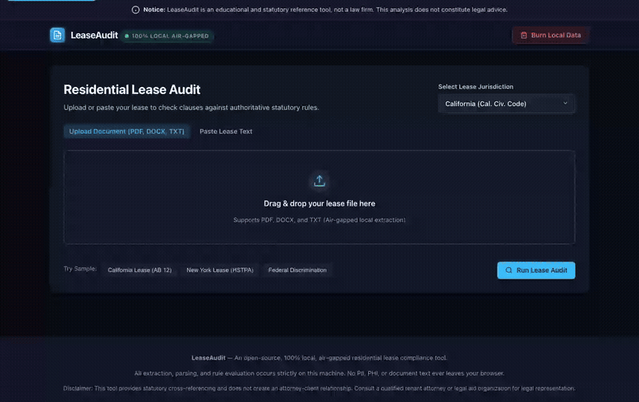

# LeaseAudit ⚖️

**100% local, statute-grounded residential lease auditing reality engine.** Paste or upload a lease to get an instant breakdown of which clauses are enforceable, which violate governing state and federal landlord-tenant statutes, and a generated dispute letter — before you sign or before your landlord tries to enforce an unlawful term.

[](LICENSE)
[](https://react.dev/)
[](https://www.typescriptlang.org/)
[](https://vitejs.dev/)
[](https://vitest.dev/)
[](#privacy--air-gap-guarantee)
[](#accessibility)

---

## The Problem

Most renters never read their lease closely, and even when they do, they have no way to tell "standard boilerplate" from "clause my landlord cannot legally enforce." Landlord-tenant law is a patchwork of federal protections (Fair Housing Act, Servicemembers Civil Relief Act) and divergent state statutes (security deposit caps, 14-to-30 day return deadlines, late fee caps, notice-to-enter rules, self-help lockout prohibitions).

Property management companies rely on this information asymmetry. **LeaseAudit removes it.**

---

## Core Flow

1. **Ingest:** Paste raw lease text or upload a document (`.txt`, `.md`).
2. **Local In-Browser Extraction:** 100% client-side text parsing with zero backend prerequisites, zero cloud calls, and zero PII/lease egress.
3. **Clause Segmentation:** Heuristic boundary detection breaks the agreement into discrete clauses.
4. **Statute Evaluation:** Clauses are checked against 29 verified statutory rules (Federal + 5 core states) and classified:
   - 🟢 **Standard:** Standard terms compliant with statutory baselines.
   - 🟡 **Watch:** Ambiguous or bordering provisions requiring attention.
   - 🔴 **Likely Unenforceable:** Clauses conflicting with mandatory statutory tenant protections.
5. **Interactive "📚 Grounded Sources" Modal:** Full transparency into official state and federal statutory codes, legislative history, and government portals.
6. **Dispute Studio:** Instantly drafts an assertive, formal dispute letter citing specific code sections (Pre-Signing Amendment Request or Tenancy Dispute Notice).
7. **🔥 Burn Local Data:** One-click button immediately purges all memory, DOM state, and session text.

---

## Quickstart (Zero Backend Setup)

```bash
# Clone the repository
git clone https://github.com/knowthankyew/lease-audit.git
cd lease-audit

# Install dependencies
npm install

# Start local dev server (opens http://localhost:3000)
npm run dev

# Run automated tests
npm test

# Build production bundle
npm run build
```

---

## 📺 Interactive Walkthrough



> Full high-definition recording available at [`demo.mp4`](demo.mp4).

---

## Statute Coverage (29 Grounded Rules)

Every single rule in LeaseAudit is grounded in official, verified statutes:

| Jurisdiction | Code | Covered Topics & Statutory Citations | Official Source |
| :--- | :--- | :--- | :--- |
| **Federal** | `FED` | - **42 U.S.C. § 3604(a):** Fair Housing Act familial status discrimination.<br>- **42 U.S.C. § 3604(f)(3)(B):** Service & emotional support animal protections.<br>- **50 U.S.C. § 3955:** Servicemembers Civil Relief Act (SCRA) early termination rights.<br>- **42 U.S.C. § 4852d:** Residential Lead-Based Paint Hazard Reduction Act. | [US Code](https://www.law.cornell.edu/uscode/text) |
| **California** | `CA` | - **Cal. Civ. Code § 1950.5(c):** Security deposit cap (1 month max rent per AB 12).<br>- **Cal. Civ. Code § 1950.5(g):** 21-day itemized deposit return timeline.<br>- **Cal. Civ. Code § 1954:** 24-hour written notice required prior to entry.<br>- **Cal. Civ. Code § 789.3:** Self-help eviction & lockout ban ($100/day statutory damages).<br>- **Cal. Civ. Code § 1941.1 & § 1942.1:** Implied warranty of habitability (non-waivable).<br>- **Cal. Civ. Code § 1671:** Late fees liquidated damages & reasonableness standard. | [California Legislative Information](https://leginfo.legislature.ca.gov) |
| **New York** | `NY` | - **N.Y. Gen. Oblig. Law § 7-108(1-a)(a):** 1-month security deposit cap (HSTPA).<br>- **N.Y. Gen. Oblig. Law § 7-108(1-a)(e):** 14-day itemized deposit return (forfeiture penalty).<br>- **N.Y. Real Prop. Law § 238-a(2):** Late fees capped at $50 or 5% after 5-day grace period.<br>- **N.Y. Real Prop. Law § 768:** Unlawful eviction & lockout criminalization (Class A misdemeanor).<br>- **N.Y. Real Prop. Law § 235-b:** Statutory warranty of habitability (non-waivable).<br>- **N.Y. Real Prop. Law § 235-f:** Roommate Law (unlawful restrictions on occupancy). | [New York State Senate](https://www.nysenate.gov/legislation/laws) |
| **Texas** | `TX` | - **Tex. Prop. Code § 92.103:** 30-day security deposit return timeline.<br>- **Tex. Prop. Code § 92.019:** Mandatory 2 full days grace period; statutory late fee caps.<br>- **Tex. Prop. Code § 92.0081:** Prohibition of unlawful tenant exclusion & lockouts.<br>- **Tex. Prop. Code § 92.008:** Prohibition of utility interruption for rent delinquency.<br>- **Tex. Prop. Code § 92.056 & § 92.006:** Non-waivable landlord repair obligations. | [Texas Constitution and Statutes](https://statutes.capitol.texas.gov/) |
| **Florida** | `FL` | - **Fla. Stat. § 83.49(3)(a):** 15-day return / 30-day notice for deposit damage claims.<br>- **Fla. Stat. § 83.53(2):** 24-hour notice of entry for repairs (Miya's Law).<br>- **Fla. Stat. § 83.67:** Prohibited landlord practices (utility termination, lockouts).<br>- **Fla. Stat. § 83.51 & § 83.47:** Non-waivable landlord duty to maintain premises. | [Online Sunshine](http://www.leg.state.fl.us/statutes/) |
| **Illinois** | `IL` | - **765 ILCS 710/1:** Security Deposit Return Act (30-day itemization, 45-day return).<br>- **765 ILCS 715/1:** Security Deposit Interest Act for buildings with 25+ units.<br>- **735 ILCS 5/9-101 et seq.:** Forcible Entry and Detainer Act (exclusive court remedy; self-help banned).<br>- **765 ILCS 720/1:** Retaliatory eviction and code reporting protection. | [Illinois General Assembly](https://www.ilga.gov/legislation/ilcs/ilcs.asp) |

---

## Privacy & Observability Architecture

LeaseAudit strictly adheres to the portfolio standard defined in [PRIVACY_TELEMETRY_SCHEMA.md](docs/PRIVACY_TELEMETRY_SCHEMA.md):

### 1. Consumer Default (Safe & Local-Only)
- **Zero Cloud Ingestion:** Parsing, segmentation, and rule evaluation execute 100% locally inside your browser session.
- **In-Memory Volatile Telemetry:** Telemetry runs via an OpenTelemetry-compatible `MemoryExporter`. Spans and metrics reside solely in memory buffers.
- **Payload Redaction:** Raw lease text, document bodies, and tenant notes are strictly scrubbed from span attributes (only rule IDs, counts, durations, and hashes are retained).
- **Session Audit Log:** Downloadable append-only audit trail (`Download session audit (JSON)`) in the Privacy verification modal.
- **🔥 Burn Local Data:** Clicking "Burn Local Data" immediately wipes all browser state, clears session memory, purges telemetry buffers, and resets the tracer to no-op.

### 2. Enterprise Overlay (Opt-In Observability)
Enterprises deploying LeaseAudit within their own infrastructure can attach an OpenTelemetry collector without code modifications:
- **Configure Collector:** Set `VITE_OTEL_EXPORTER_OTLP_ENDPOINT` (e.g. `https://otel-collector:4318/v1/traces`).
- **Telemetry Retention:** Set `privacy.burn_enabled: false` if enterprise policy requires retaining trace streams across UI resets.
- **Audit Honesty:** The header indicator and Privacy Verification modal honestly reflect whether the app is in `Zero Network • Memory-Only` or `OTLP Active` mode.

---

## Accessibility (Day 1 Compliance)

- **Landmarks & Semantics:** HTML5 landmarks (`header`, `main`, `footer`, `section`, `article`).
- **Live Regions:** Screen reader announcers broadcast audit completion stats and dispute actions.
- **Full Keyboard Navigation:** All controls, filter pills, and modal dialogs respond to `Tab`, `Enter`, and `Space`.
- **Focus Trapping & Dismissal:** Modals trap focus while open and restore focus upon dismissal.
- **High-Contrast Obsidian Palette:** High-contrast tokens verified against WCAG AA standards.

---

## Automated Verification Suite

```bash
# Run Vitest test suite
npm test
```

Tests cover:
- Document normalization and heading segmentation.
- Boundary detection across complex residential leases.
- Full statutory citation verification (ensuring all 29 rules have official legal citations and valid regex patterns).
- High-risk clause detection for California, New York, Texas, Florida, Illinois, and Federal rules.
- Dispute letter generation for pre-signing amendment requests and active tenancy notices.
- **Client-Side Edge ML Scaffold & In-Browser ONNX Runtime (Phase 3a & 3b):** Web Worker off-main-thread execution, autoregressive ONNX neural token generation with WebGPU/WASM, ChatML tokenization, heuristic fallback analyzer, and Pillar 1 hard burn memory teardown (55/55 tests passing).

---

## Phase 3: Client-Side Edge Inference (The FTaaS Bridge) ⚡

LeaseAudit features a production **hybrid dual-engine architecture**:
1. **Deterministic Statutory Regex Rule Engine**: Instant evaluation against verified state/federal statutes.
2. **Client-Side Edge Semantic Engine (Phase 3a)**:
   - Evaluates complex legal edge cases using an off-main-thread Web Worker (`edge-worker.ts`) and singleton service (`edge-service.ts`).
   - Computes an automated **Unconscionability & Predatoriness Score (0–100%)**, detects hidden rights waivers (e.g. habitability disclaimers, jury trial surrenders, exculpatory indemnity), and generates tailored, tenant-protective counter-amendments with streaming tokens.
   - **Pillar 1 Invariant**: Clicking "Burn Local Data" terminates the Web Worker, purges all model and prompt memory buffers, and sets an unrecoverable tombstone.
   - **Pillar 3 Invariant**: Edge operational telemetry strictly sanitizes attributes using `DEFAULT_SAFE_ALLOWLIST_KEYS`; zero prompt, clause text, or model output is ever recorded.
   - **Pillar 4 Invariant**: Honest UI badges clearly distinguish client-side heuristic evaluation from neural execution (`⚡ ONNX WebGPU (~38 tok/s)` vs `Edge Semantic (Offline)`).
3. **In-Browser ONNX Runtime Web Execution (Phase 3b - COMPLETED)**:
   - Direct execution of the exported `SmolLM2-135M` LoRA transformer via `onnxruntime-web` targeting **WebGPU** with **WebAssembly (WASM SIMD)** fallback.
   - Client-side subword tokenizer (`tokenizer.ts`) with ChatML prompt formatting, fast `BigInt64Array` encoding, and streaming autoregressive token decoding.
   - Seamless dual-engine fallback: operates via full neural inference when models are loaded, and gracefully falls back to deterministic heuristic evaluation if weights are omitted or unavailable.

---

## Legal Disclaimer

> [!IMPORTANT]
> **LeaseAudit is an educational tool and does not provide legal advice.**
> Landlord-tenant laws vary by jurisdiction, municipality (e.g., local rent control ordinances), and specific lease facts. Reviewing a lease with LeaseAudit does not create an attorney-client relationship. If you are facing eviction, unlawful lockouts, or an active legal dispute, contact a licensed tenant attorney or your local legal aid society.

---

## License

MIT © 2026 The LeaseAudit Contributors. See [LICENSE](LICENSE) for details.
